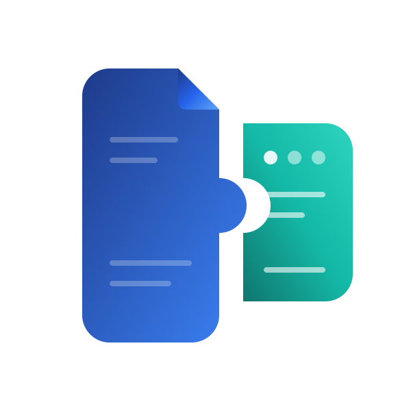

<p align="center">
  
</p>

# Papra Companion

[](https://github.com/remotesojourner/papra-companion/actions/workflows/ci.yml)
[](https://github.com/remotesojourner/papra-companion/releases/latest)
[](LICENSE.txt)
[](AI-DECLARATION.md)

A self-hosted Blazor Server companion application for [Papra](https://github.com/papra-hq/papra), the open-source document management system.

---

## Features

- **Title Generation** — receives a webhook from Papra on every document upload and automatically:
  1. Downloads the document metadata via the Papra API
  2. Generates a descriptive document title using any OpenAI-compatible API
  3. Writes the title back to Papra
- **Email attachment downloader** — polls an IMAP mailbox on a configurable schedule, downloads matching attachments, and saves them to Papra's watched folder
  - Subject-line regex filtering (with optional case-insensitive / match-anywhere modes)
  - Custom filename templates
  - Optional delete-after-download (with copy-to-folder support)

---

## Prerequisites

| Requirement | Notes |
|---|---|
| [Papra](https://github.com/papra-hq/papra) instance | Must be reachable from the Companion container |
| OpenAI API Key | Required for title generation. Works with any OpenAI-compatible API |
| Docker + Docker Compose | Recommended deployment method |

---

## Quick Start (Docker Compose)


1. **Create a `docker-compose.yml`** with the following content:

   ```yaml
   services:
     papra-companion:
       container_name: papra-companion
       restart: unless-stopped
       image: ghcr.io/remotesojourner/papra-companion:latest
       ports:
         - "1003:1003"
       volumes:
         - ./data:/app/data
         - /path/to/papra/ingestion:/app/attachments
   ```

   **Volume notes:**
   - `./data` — stores the SQLite database and Data Protection keys on the host next to your compose file. Created automatically on first run.
   - `/path/to/papra/ingestion` — replace this with the path to the folder that Papra watches for new documents. Please note that it needs to have the organisation id at the end. e.g. /papra/consume/org_bwnnm9xppyw81ru5r3wvvr5d. Any attachment downloaded from email will be dropped here and picked up by Papra automatically.

2. **Start the stack**

   ```bash
   docker compose up -d
   ```

   The app will be available on port `1003` of the host you deployed it on (e.g. `http://192.168.1.100:1003`).

3. **Configure via the Settings page**

   Open the browser, navigate to **Settings**, and complete the configuration tabs (see [Configuration](#configuration) below).
   > [!IMPORTANT]
   > Make sure to set a **Processing Delay** (e.g. 15-30 seconds) in the AI Services tab. This gives Papra enough time to finish indexing the document content before the Companion asks the AI to generate a title.

4. **Register the webhook in Papra**

   In Papra, go to **Settings → Webhooks** and add the webhook URL displayed on the Papra settings tab in the Companion. The exact URL is shown there ready to copy. When configuring the webhook, make sure to select only the **Document created** event — that is the only event Papra Companion handles. From this point on, every document uploaded to Papra will automatically be processed by the title generation service.

---

## Configuration

Most configuration is stored in the SQLite database and managed through the browser-based Settings UI. Authentication is controlled via environment variables (see [Environment Variables](#environment-variables) below).

### Environment Variables

#### Authentication (OIDC)

OIDC authentication is **optional**. When `OIDC_ISSUER` is not set the app runs without authentication.

To enable it, add the following to your `docker-compose.yml`:

```yaml
services:
  papra-companion:
    environment:
      - OIDC_ISSUER=https://your-provider.example.com
      - OIDC_CLIENT_ID=your-client-id
      - OIDC_CLIENT_SECRET=your-client-secret
```

| Variable | Required | Description |
|---|---|---|
| `OIDC_ISSUER` | No | Issuer URL of your OIDC provider (e.g. Authentik, Keycloak, Dex). When absent, authentication is disabled. |
| `OIDC_CLIENT_ID` | When `OIDC_ISSUER` is set | Client ID registered with your OIDC provider |
| `OIDC_CLIENT_SECRET` | When `OIDC_ISSUER` is set | Client secret for the registered application |

When authentication is enabled:
- Unauthenticated users are automatically redirected to the OIDC provider — there is no local login screen.
- After sign-in, users are redirected back to the app.
- The authenticated username is shown in the top navigation bar alongside a logout button.

The redirect URI to register with your OIDC provider is:
```
http(s)://<your-companion-host>/signin-oidc
```

---

### Tab: Papra

| Field | Description |
|---|---|
| **Base URL** | Root URL of your Papra instance, e.g. `https://documents.example.com` (no trailing slash) |
| **API Token** | Bearer token from Papra's user settings page |
| **Webhook URL** | Read-only display — copy this into Papra's webhook configuration. Make sure the event being sent is "Document created" |

Use the **Test Connection** button to verify that the Companion can reach your Papra instance and authenticate successfully before saving.

### Tab: AI Services

| Field | Description |
|---|---|
| **OpenAI API Key** | Required. Used for title generation |
| **OpenAI Base URL** | Optional. Set this to use an alternative OpenAI-compatible provider (e.g. Ollama, LiteLLM) |
| **OpenAI Model** | Model name, e.g. `gpt-4o-mini` (default) |
| **Processing Delay** | Number of seconds to wait before processing a document |
| **Title Extraction Prompt** | Customize the prompt sent to the model |

### Tab: Email

Configures the IMAP attachment downloader background service.

| Field | Description |
|---|---|
| **Enabled** | Toggles the background polling service on/off |
| **Host** | IMAP server hostname |
| **Port** | Default: `993` |
| **Username / Password** | IMAP credentials |
| **Use SSL** | Enable implicit SSL/TLS (recommended) |
| **Use STARTTLS** | Enable STARTTLS (for servers that don't use implicit SSL) |
| **IMAP Folder** | Mailbox folder to poll, e.g. `INBOX` |
| **Subject Regex** | Regular expression to filter emails by subject line |
| **Case-insensitive** | Apply the regex case-insensitively |
| **Match anywhere** | Match the regex anywhere in the subject (not just from the start) |
| **Filename Template** | Template for naming saved attachments |
| **Delete after download** | Remove the email from the server after downloading its attachments |
| **Copy-to folder** | If deleting, first copy the message to this IMAP folder |
| **Poll interval** | How often to check for new mail, in seconds (default: `300`) |

---

## Development Setup

### Requirements

- .NET 10 SDK

### Run locally

```bash
cd Papra.Companion
dotnet run
```

### Tailwind CSS

Tailwind v4 is configured as a standalone CLI pipeline:

- The CLI binary is downloaded by an MSBuild target (`DownloadTailwind`) on first build
- The `Tailwind` MSBuild target runs the CLI to compile `wwwroot/css/app.css` → `wwwroot/css/app.min.css`
- The source `app.css` is excluded from the published output (only the compiled `app.min.css` is deployed)
- The pinned version is set via `<TailwindVersion>` in the `.csproj`

### Database migrations

EF Core migrations are applied automatically on startup via `MigrateAsync()`. To add a new migration during development:

```bash
dotnet ef migrations add <MigrationName> --project Papra.Companion.Data --startup-project Papra.Companion
```

---

## Technology Stack

| Component | Technology |
|---|---|
| Framework | ASP.NET Core 10, Blazor Server (Interactive Server render mode) |
| UI components | [Flowbite Blazor](https://flowbite-blazor.com/) |
| CSS | Tailwind CSS v4 (standalone CLI) |
| Database | SQLite via Entity Framework Core |
| HTTP clients | `System.Net.Http.Json` with typed DTOs |
| IMAP | [MailKit](https://github.com/jstedfast/MailKit) |
| Containers | Docker + Docker Compose |

---

## License

This project is provided as-is. See [LICENSE](LICENSE.txt) for details.

---

## FAQ

### Why was this created?

Two reasons:

**Email injection** — Papra supports email-based document injection, but that requires either [OWLRelay](https://owlrelay.email/) or your own Cloudflare Worker. I wanted a much simpler self-hosted approach: a dedicated IMAP inbox I can forward emails to. Papra Companion polls that inbox on a schedule, downloads any matching attachments straight into Papra's watched folder, and optionally deletes or moves the email afterwards. No third-party relay service, no Cloudflare account, no extra infrastructure.

**Automated titles** — Papra handles document ingestion, but titles often need to be set manually or cleaned up. I didn't want to do that for every document. Papra Companion intercepts the webhook fired on each upload, then uses an LLM to generate a descriptive, clean title automatically.

---

### But these features are already planned in Papra…

I do not see this as a long-term project. Ideally Papra will support all of this natively and I can happily retire this companion. The only reason I didn't contribute upstream is that I am very comfortable with C# — spinning this up with AI assistance while making sure it met my needs was far easier than learning a new language and codebase from scratch.

---

### Is this yet another vibe-coded, low-quality project?

Quality is subjective. I have been working with C# for over two decades. All the code here was done as pair programming with AI rather than blindly accepting AI output. I have also added an [AI Declaration](AI-DECLARATION.md) to be fully transparent about how AI was used. At the end of the day, this is solving a real need I have.

---

### Do you plan to add new features?

If I come across a new idea or receive a suggestion that fits into a document-processing workflow, I will consider adding it. No roadmap or guarantees — this project exists to solve my own needs first.

The system natively supports any OpenAI-compatible API, meaning you can plug in local models via Ollama, use API gateways like LiteLLM, or connect to alternative providers that support the OpenAI spec.